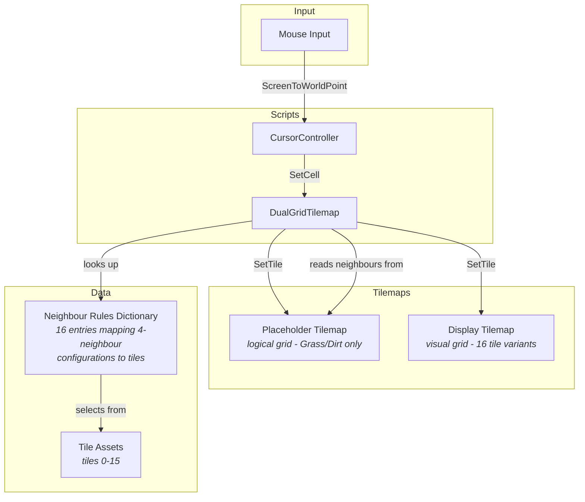
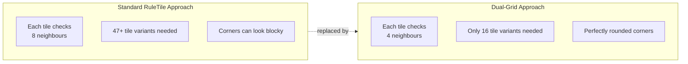
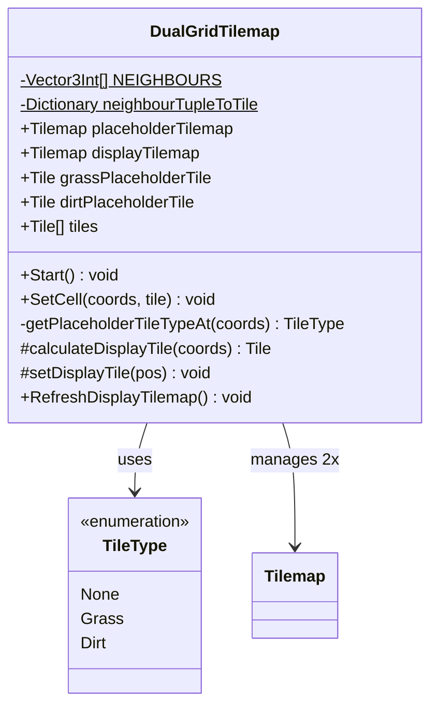
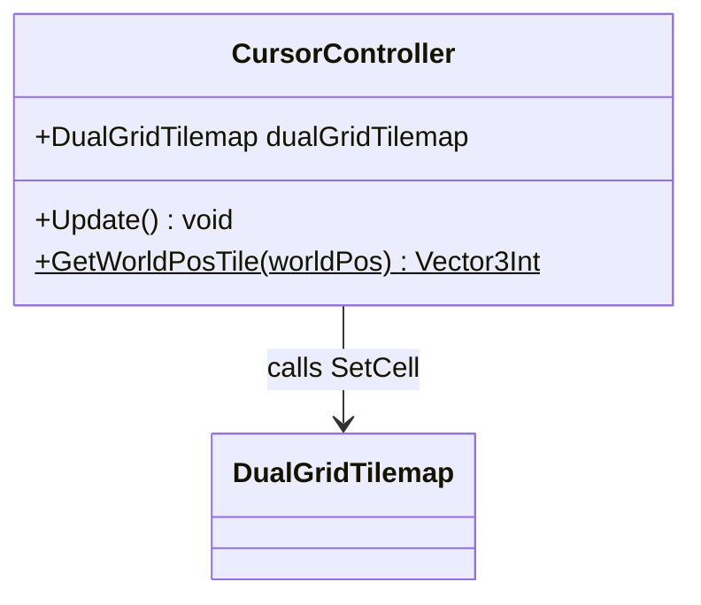
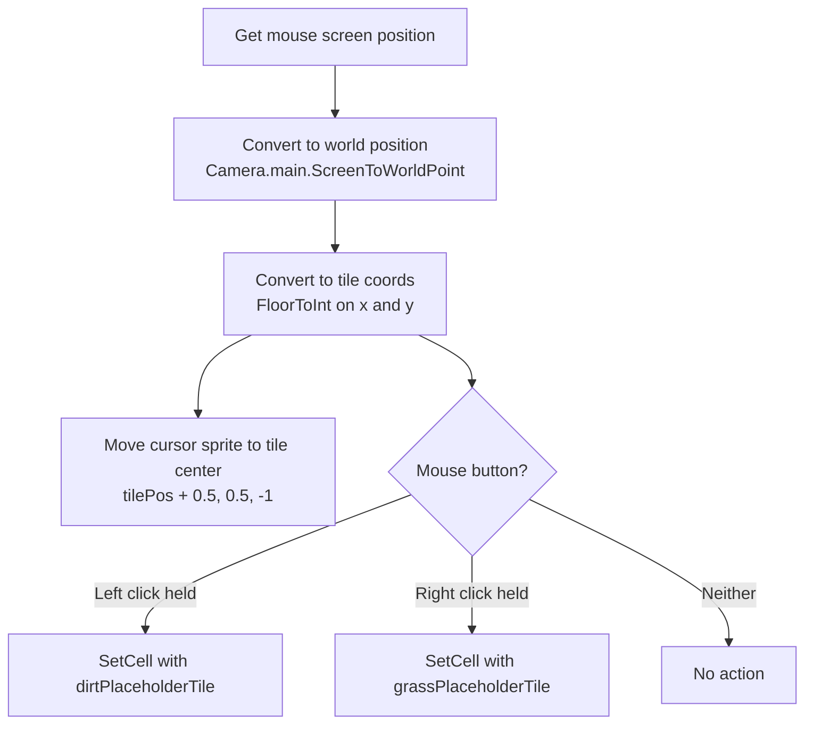
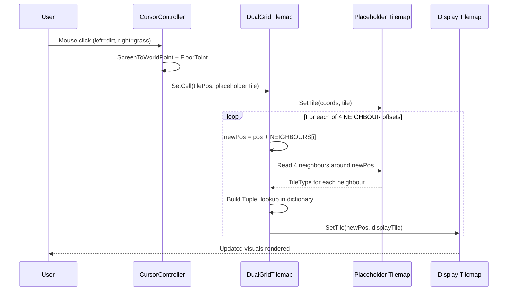
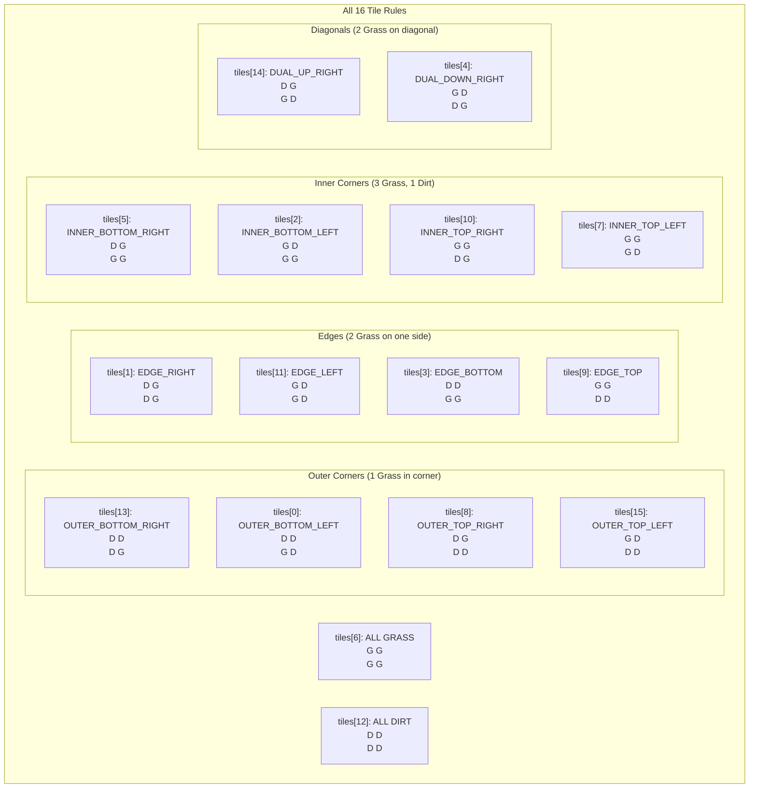
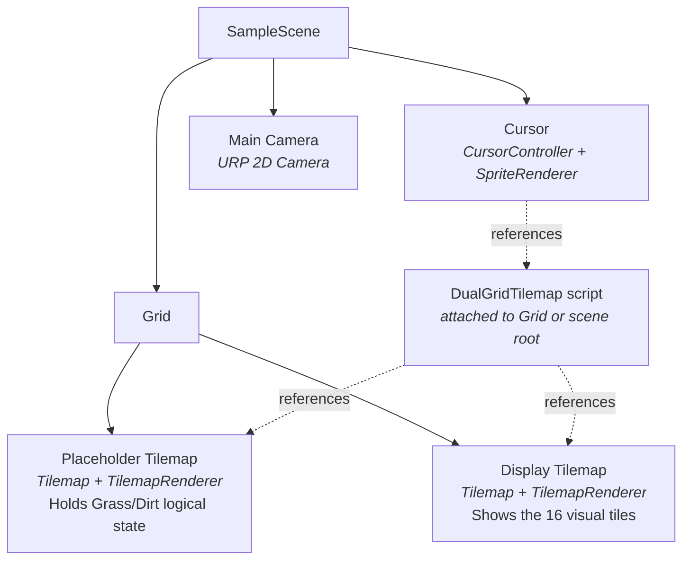
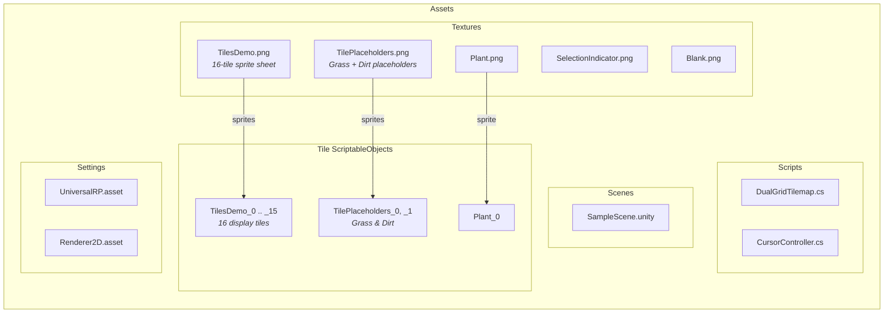

# Dual-Grid Tilemap System - Codebase Overview

## Table of Contents

- [Project Summary](#project-summary)
- [Architecture Overview](#architecture-overview)
- [The Dual-Grid Concept](#the-dual-grid-concept)
- [Core Components](#core-components)
  - [DualGridTilemap.cs](#dualgridtilemapcs)
  - [CursorController.cs](#cursorcontrollercs)
  - [TileType Enum](#tiletype-enum)
- [Data Flow](#data-flow)
- [Tile Mapping System](#tile-mapping-system)
- [Scene Hierarchy](#scene-hierarchy)
- [Asset Structure](#asset-structure)
- [Project Dependencies](#project-dependencies)

---

## Project Summary

| Property | Value |
|----------|-------|
| **Engine** | Unity 2023.1.11f1 |
| **Render Pipeline** | Universal Render Pipeline (URP) 2D |
| **Scripts** | 2 C# files (126 total lines) |
| **Tile Assets** | 16 display tiles + 2 placeholder tiles + 1 plant |
| **Scene** | SampleScene |

This project demonstrates a **dual-grid tilemap system** -- a technique for rendering smooth terrain transitions using only **16 tiles** instead of the 47+ required by Unity's built-in `RuleTile` approach. The system was inspired by [Oskar Stalberg's dual-grid proposition](https://x.com/OskSta/status/1448248658865049605).

---

## Architecture Overview



---

## The Dual-Grid Concept

The key insight of the dual-grid system is that the **display tilemap is offset** from the **placeholder tilemap** by half a tile in both axes. Each display tile sits at the intersection of four placeholder tiles and its appearance is determined by the types of those four neighbours.



### How the Grids Overlap

```
Placeholder Grid (logical):       Display Grid (visual):

  Each cell = Grass or Dirt          Each cell = one of 16 tiles
                                     offset by (+0.5, +0.5)

  +-----+-----+-----+               
  |  G  |  G  |  D  |                  +-----+-----+
  +-----+-----+-----+                  | t10 | t9  |
  |  G  |  D  |  D  |               +-----+-----+-----+
  +-----+-----+-----+               | t2  | t0  | t12 |
  |  G  |  G  |  D  |               +-----+-----+-----+
  +-----+-----+-----+                  | t6  | t3  |
                                        +-----+-----+

  G = Grass, D = Dirt               Each display tile sits at the
                                     intersection of 4 placeholder cells
```

Each display tile's position corresponds to a 2x2 block of placeholder tiles:

```
+------+------+
| topL | topR |     This 2x2 pattern produces a
+------+------+     Tuple<TileType x4> that maps
| botL | botR |     to exactly one of 16 tiles
+------+------+
```

---

## Core Components

### DualGridTilemap.cs

**Path:** `Assets/Scripts/DualGridTilemap.cs` (99 lines)
**Role:** The core engine -- manages both tilemaps and the rule-based tile selection.



#### Key Fields

| Field | Type | Purpose |
|-------|------|---------|
| `NEIGHBOURS` | `Vector3Int[4]` | The four 2x2 offsets: `(0,0)`, `(1,0)`, `(0,1)`, `(1,1)` |
| `neighbourTupleToTile` | `Dictionary<Tuple<TileType x4>, Tile>` | Maps all 16 possible 4-neighbour configs to display tiles |
| `placeholderTilemap` | `Tilemap` | The logical grid (Grass or Dirt per cell) |
| `displayTilemap` | `Tilemap` | The visual grid (one of 16 transition tiles per cell) |
| `tiles` | `Tile[16]` | Array of all display tile assets, assigned in the Inspector |

#### Key Methods

**`Start()`** -- Initializes the 16-entry rule dictionary and calls `RefreshDisplayTilemap()`.

**`SetCell(Vector3Int coords, Tile tile)`** -- The public API for placing tiles:
1. Sets the tile on the placeholder tilemap
2. Triggers display recalculation via `setDisplayTile()`

**`getPlaceholderTileTypeAt(Vector3Int coords)`** -- Returns `Grass` if the placeholder tile matches the grass reference, otherwise `Dirt` (default fallback).

**`calculateDisplayTile(Vector3Int coords)`** -- The core algorithm:
1. Reads the 4 placeholder neighbours by subtracting each `NEIGHBOURS` offset
2. Builds a `Tuple<TileType, TileType, TileType, TileType>`
3. Looks up and returns the matching display tile

**`setDisplayTile(Vector3Int pos)`** -- Updates the display tile at `pos` **and** its 3 adjacent display tiles (since changing one placeholder cell affects up to 4 display cells).

**`RefreshDisplayTilemap()`** -- Brute-force recalculates all display tiles in a 100x100 area (-50 to +50 on both axes).

---

### CursorController.cs

**Path:** `Assets/Scripts/CursorController.cs` (27 lines)
**Role:** Translates mouse input into tile placement/removal operations.



#### Behaviour (per frame in `Update`)



The cursor's z-position is set to `-1` so the selection indicator renders above the tilemap.

---

### TileType Enum

```csharp
public enum TileType {
    None,   // unused default
    Grass,  // terrain type A
    Dirt    // terrain type B
}
```

A simple two-terrain system. `None` exists as a default but is never used in the rule dictionary.

---

## Data Flow

This diagram shows the complete flow from mouse click to pixel on screen:



### Why 4 display tiles update per change

When a single placeholder cell changes, it participates in the 2x2 neighbourhood of **four** different display cells. All four must be recalculated:

```
Changed placeholder cell: X

Display cells affected:
  +---+---+
  | A | B |   A uses X as its bottom-right
  +---X---+   B uses X as its bottom-left
  | C | D |   C uses X as its top-right
  +---+---+   D uses X as its top-left
```

---

## Tile Mapping System

All 16 possible 2x2 neighbour configurations and their corresponding tile indices:



### Tile Index Reference Table

| Index | Name | topLeft | topRight | botLeft | botRight |
|:-----:|------|:-------:|:--------:|:-------:|:--------:|
| 0 | OUTER_BOTTOM_LEFT | D | D | G | D |
| 1 | EDGE_RIGHT | D | G | D | G |
| 2 | INNER_BOTTOM_LEFT | G | D | G | G |
| 3 | EDGE_BOTTOM | D | D | G | G |
| 4 | DUAL_DOWN_RIGHT | G | D | D | G |
| 5 | INNER_BOTTOM_RIGHT | D | G | G | G |
| 6 | ALL_GRASS | G | G | G | G |
| 7 | INNER_TOP_LEFT | G | G | G | D |
| 8 | OUTER_TOP_RIGHT | D | G | D | D |
| 9 | EDGE_TOP | G | G | D | D |
| 10 | INNER_TOP_RIGHT | G | G | D | G |
| 11 | EDGE_LEFT | G | D | G | D |
| 12 | ALL_DIRT | D | D | D | D |
| 13 | OUTER_BOTTOM_RIGHT | D | D | D | G |
| 14 | DUAL_UP_RIGHT | D | G | G | D |
| 15 | OUTER_TOP_LEFT | G | D | D | D |

---

## Scene Hierarchy



---

## Asset Structure



---

## Project Dependencies

Key packages from `Packages/manifest.json`:

| Package | Version | Purpose |
|---------|---------|---------|
| `com.unity.feature.2d` | 2.0.0 | 2D features bundle (includes Tilemap, Sprite, etc.) |
| `com.unity.render-pipelines.universal` | 15.0.6 | URP rendering pipeline |
| `com.unity.modules.tilemap` | 1.0.0 | Core tilemap module |
| `com.unity.textmeshpro` | 3.0.6 | Text rendering (UI) |
| `com.unity.ide.rider` | 3.0.24 | JetBrains Rider integration |
| `com.unity.ide.visualstudio` | 2.0.18 | Visual Studio integration |
| `com.unity.test-framework` | 1.3.7 | Unit testing |

---

*Generated from codebase analysis. Original concept by [Oskar Stalberg](https://x.com/OskSta/status/1448248658865049605). Implementation by [jess-hammer](https://github.com/jess-hammer/dual-grid-tilemap-system-unity).*
